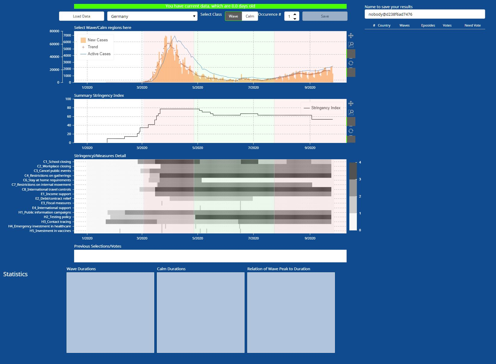
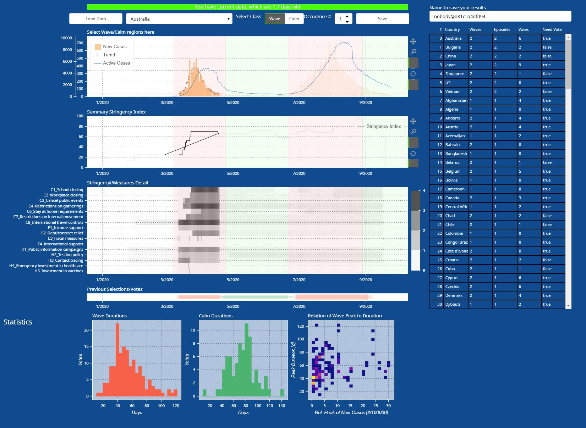

# CookieCutter

CookieCutter tool to select from (currently) [Johns Hokpins](https://github.com/CSSEGISandData/COVID-19) and 
[Oxford Covid-19 Government Response Tracker (OxCGRT)](https://github.com/OxCGRT/covid-policy-tracker) in order
to be able to understand compare COVID-19 infection waves and periods of quiet together with changes
to country wide policies.

This tool has been written very fast without too much consideration on code quality or maintainability,
as a Minimum Viable Product to understand the features actually required to make such a tool useful.

Its contains a crude detection of infection wave(s) and periods of quiet, based on continually growing or decresing 
(and levelling off) of new reported cases of infection data.

The author understands there are other, country level data sources with at times higher quality, definitely
different numbers, but the purpose of the tool is to collect infection waves using human ingenuity, and
precision is probably not required for this task initially.

## Setup

Clone the repository. You will need the python bokeh package, best installed using `conda install bokeh`, although
it is part of any [anaconda distribution](https://www.anaconda.com/products/individual). Also ensure you have 
[`statsmodels`](https://pypi.org/project/statsmodels/) installed.

## UI

Basic screenshot.

UI Elements are
* a top status bar which initially displays how old the underlying data are, or if there was an issue locating it
* "Load Data" downloads the data from the github repos
* The dropdown box allows the selection of countries, it is sorted by the percentage increase of new cases, i.e. countries with high
 infection growth rates should be at the top. It is still possible to type the desired country name when the dropdown widget is seletced
* A text field to name the episode. This will be re-engineered to get consistent data files. Nomenclature suggested is `<country> wave|calm #`
  with the country name, the term `wave` if the user selects a wave, or `calm`to specify perios of low activity, and a running number
* A save button becomes active when the user made a selection
* The top time series plot shows bars representing new cases reported, a smoothed trend line to counteract weekend phenomena, and a total
 active cases line, for the selected country
* the center time series shows the ["Stringency Index for Display" value](https://github.com/OxCGRT/covid-policy-tracker/blob/master/documentation/codebook.md)
* the grey heatmap details [which measures were taken](https://github.com/OxCGRT/covid-policy-tracker/blob/master/documentation/codebook.md)
* The table to the right gives a synposis of which countries have been voted on and which may need a vote. While this is being re-engineered,
 it will only be updated after pressing F5 or page refresh

Selection of an eposode and naming it.

Saving a selected episode.

